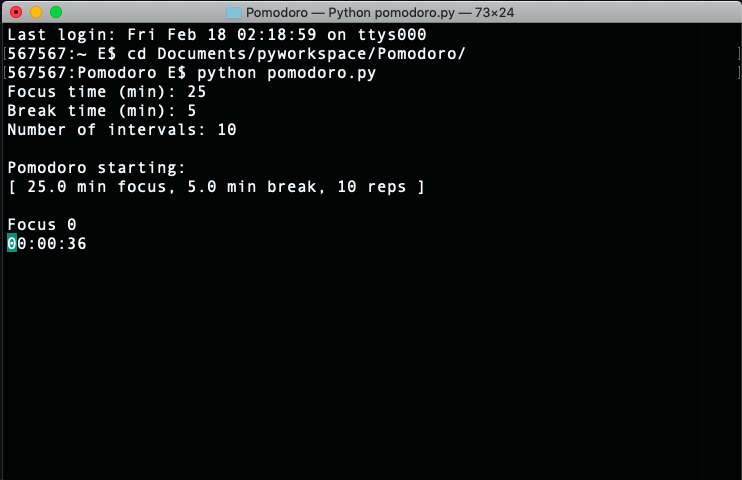

# Pomodoro
DIY pomodoro timer. Clone the repo and run it in Python 3. Requires `afplay` which is built into MacOS. 

You will be prompted to enter your parameters. Hit `enter` 3 times to use the default parameters.

## future features

- multiprocessing to get the timer to run concurrently
- optimizing the for loop timing
- visual progress bar
- basic GUI
- advanced parameters (increasing time_period with each iteration)
- countdown instead of up
